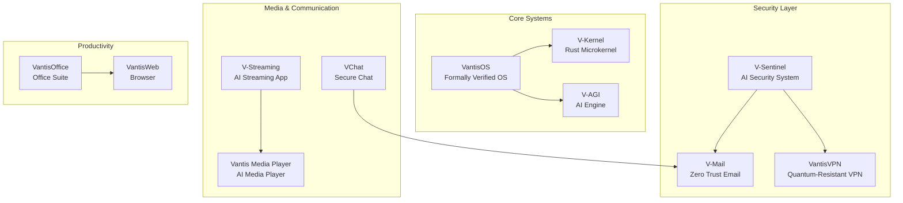
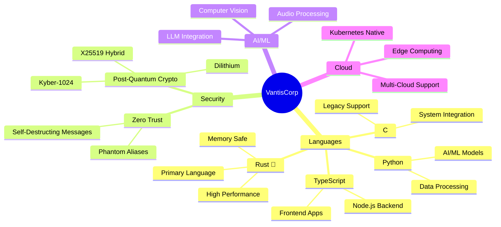
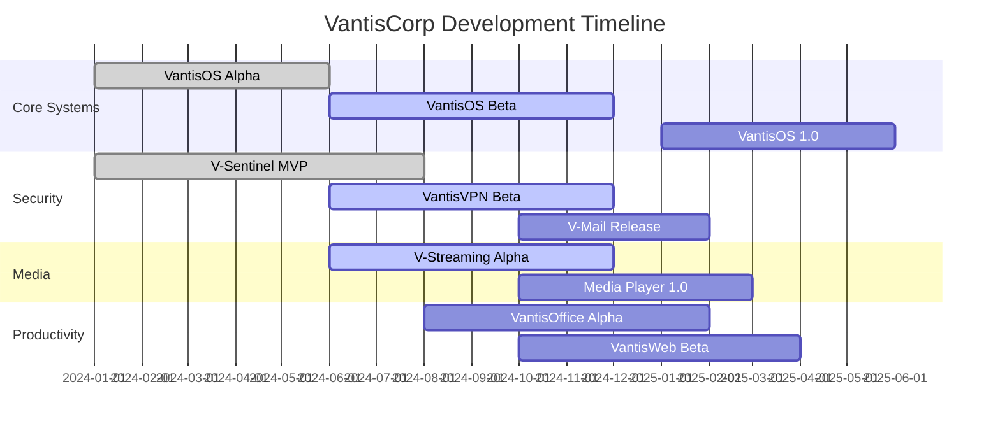

<!-- 
  ╔═══════════════════════════════════════════════════════════════════════════╗
  ║  🎬 VANTIS CORP - Netflix-Style Profile README                              ║
  ║  Version: 2.0.0 | Last Updated: 2025                                        ║
  ╠═══════════════════════════════════════════════════════════════════════════╣
  ║  Easter Egg #1: Decode this Base64 to find secret branch:                  ║
  ║  dmFudGlzLXNlY3JldC1kZXY=                                                   ║
  ║  Easter Egg #2: Look for zero-width characters in this file                ║
  ╚═══════════════════════════════════════════════════════════════════════════╝
-->

<!-- ===================== ANIMATED BANNER ===================== -->
<div align="center">
  
  <!-- Netflix-style animated gradient banner -->
  

  <!-- Typewriter Effect -->
  <picture>
    <source media="(prefers-color-scheme: dark)" srcset="https://readme-typing-svg.demolab.com?font=Fira+Code&weight=500&size=28&duration=3000&pause=1000&color=DC143C&center=true&vCenter=true&multiline=true&repeat=true&width=800&height=100&lines=🦀+Rust-First+Architecture;🔐+Quantum-Resistant+Security;🚀+Cloud-Native+Ready;🤖+AI-Powered+Solutions">
    <source media="(prefers-color-scheme: light)" srcset="https://readme-typing-svg.demolab.com?font=Fira+Code&weight=500&size=28&duration=3000&pause=1000&color=DC143C&center=true&vCenter=true&multiline=true&repeat=true&width=800&height=100&lines=🦀+Rust-First+Architecture;🔐+Quantum-Resistant+Security;🚀+Cloud-Native+Ready;🤖+AI-Powered+Solutions">
    
  </picture>

  <!-- Dynamic Badges Row -->
  <p align="center">
    
    
    
    
  </p>

  <!-- Activity Indicators -->
  <p align="center">
    <a href="https://github.com/vantisCorp">
      
    </a>
    
  </p>

</div>

<!-- ===================== DISCLAIMER ===================== -->
<div align="center">
  
  
  
</div>

> ⚠️ **DISCLAIMER: EXPERIMENTAL SANDBOX & FORKED PROJECTS**
> 
> * **My Projects:** This profile serves as an ongoing experiment and testbed. My original repositories are **NOT** officially released, production-ready products. Expect breaking changes, WIP branches, and continuous evolution as I use AI tools to generate and refine the codebase.
> * **Third-Party Forks (e.g., OBS):** Some repositories found here are **not my original creations**. They have been forked or mirrored to my profile solely for custom configuration, personal development, and testing. **Do not use my forks for your daily use unless you know exactly what you are doing.** Please always use and support the official, upstream repositories for such software (e.g., the official OBS Studio repo, Rust repository or Kernel).

---

<!-- ===================== ABOUT SECTION ===================== -->
<div align="center">
  
  
  
</div>

<table>
<tr>
<td width="50%">
  
  ### 🎯 Mission
  
  Building next-generation software with **security-first** approach and **quantum-resistant** architecture. Creating alternatives to mainstream software that respect privacy and performance.
  
</td>
<td width="50%">
  
  ### 💡 Philosophy
  
  - 🔒 **Security by Design** - Not an afterthought
  - 🦀 **Rust-First** - Memory safety without GC
  - 🤖 **AI-Native** - Intelligence built-in
  - 🌍 **Open Source** - Transparency & trust
  
</td>
</tr>
</table>

---

<!-- ===================== SKILL ICONS ===================== -->
<div align="center">
  
  <h3>🛠️ Technology Stack</h3>
  
  <a href="https://www.rust-lang.org/">
    
  </a>
  <a href="https://www.typescriptlang.org/">
    
  </a>
  <a href="https://www.python.org/">
    
  </a>
  <a href="https://git-scm.com/">
    
  </a>
  <a href="https://www.docker.com/">
    
  </a>
  <a href="https://kubernetes.io/">
    
  </a>
  <a href="https://www.linux.org/">
    
  </a>
  <a href="https://react.dev/">
    
  </a>
  <a href="https://tauri.app/">
    
  </a>
  <a href="https://aws.amazon.com/">
    
  </a>
  
</div>

---

<!-- ===================== SOCIAL & LINKS ===================== -->
<div align="center">
  
  <h3>🌐 Connect With Us</h3>
  
  <a href="https://github.com/vantisCorp">
    
  </a>
  <a href="https://discord.gg/vantis">
    
  </a>
  <a href="https://twitter.com/vantisCorp">
    
  </a>
  <a href="https://linkedin.com/company/vantisCorp">
    
  </a>
  
  <br/><br/>
  
  <!-- Sponsor Button -->
  <a href="https://github.com/sponsors/vantisCorp">
    
  </a>
  <a href="https://ko-fi.com/vantisCorp">
    
  </a>
  
</div>

---

<!-- ===================== INTERACTIVE MENU ===================== -->
<details>
<summary><h2 align="center">🎮 INTERACTIVE MENU - Choose Your Path</h2></summary>

<div align="center">

| 🎬 **Content Creator** | 💻 **Developer** | 🛡️ **Security Expert** | 🚀 **DevOps Engineer** |
|:---:|:---:|:---:|:---:|
| [→ V-Streaming](#-v-streaming) | [→ VantisOS](#-vantisos) | [→ V-Sentinel](#-v-sentinel) | [→ VantisVPN](#-vantisvpn) |
| [→ Vantis Media Player](#-vantis-media-player) | [→ V-Kernel](#-v-kernel) | [→ V-Mail](#-v-mail) | [→ VantisWeb](#-vantisweb) |
| [→ VChat](#-vchat) | [→ V-AGI](#-v-agi) | [→ VantisOffice](#-vantisoffice) | [→ All Repositories](#-full-repository-list) |

</div>

> 💡 **Pro Tip:** Click on the category that matches your role to jump directly to relevant projects!

</details>

<!-- ===================== NETFLIX-STYLE MATCH SCORE ===================== -->
<div align="center">
  
  <!-- 99% Match Badge -->
  <table>
    <tr>
      <td>
        
      </td>
      <td>
        <b>Perfect for developers who value:</b><br/>
        <code>Performance</code> • <code>Security</code> • <code>Modern Architecture</code> • <code>Rust</code>
      </td>
    </tr>
  </table>
  
</div>

<!-- ===================== BINGE-WATCHING PROGRESS BAR ===================== -->
<div align="center">
  
  <h3>📊 Project Development Progress</h3>
  
  <!-- VantisOS Progress -->
  <p>
    <br/>
    
  </p>
  
  <!-- V-Sentinel Progress -->
  <p>
    <br/>
    
  </p>
  
  <!-- V-Streaming Progress -->
  <p>
    <br/>
    
  </p>
  
</div>

<!-- ===================== TOP 10 FEATURES (Netflix Style) ===================== -->
<div align="center">
  
  
  
</div>

<table>
<tr>
<td width="60"><h1 style="color: #DC143C; text-shadow: 2px 2px 4px #000;">1</h1></td>
<td>
<b>🔐 Quantum-Resistant VPN</b><br/>
<code>VantisVPN</code> - Post-quantum cryptography with Kyber-1024 and X25519 hybrid encryption
</td>
</tr>
<tr>
<td><h1 style="color: #DC143C; text-shadow: 2px 2px 4px #000;">2</h1></td>
<td>
<b>🧠 AI-Native Security System</b><br/>
<code>V-Sentinel</code> - Ring -1 Hypervisor with AI Prediction Engine
</td>
</tr>
<tr>
<td><h1 style="color: #DC143C; text-shadow: 2px 2px 4px #000;">3</h1></td>
<td>
<b>🦀 Formally Verified OS</b><br/>
<code>VantisOS</code> - Mathematically proven operating system with Verus
</td>
</tr>
<tr>
<td><h1 style="color: #DC143C; text-shadow: 2px 2px 4px #000;">4</h1></td>
<td>
<b>🎬 AI-Powered Streaming</b><br/>
<code>V-Streaming</code> - VTubing, auto-clipping, and dual-output streaming
</td>
</tr>
<tr>
<td><h1 style="color: #DC143C; text-shadow: 2px 2px 4px #000;">5</h1></td>
<td>
<b>📧 Military-Grade Email</b><br/>
<code>V-Mail</code> - Zero Trust architecture with Phantom aliases
</td>
</tr>
<tr>
<td><h1 style="color: #DC143C; text-shadow: 2px 2px 4px #000;">6</h1></td>
<td>
<b>🌐 High-Performance Browser</b><br/>
<code>VantisWeb</code> - Rust-based browser with advanced security
</td>
</tr>
<tr>
<td><h1 style="color: #DC143C; text-shadow: 2px 2px 4px #000;">7</h1></td>
<td>
<b>📺 AI Media Player</b><br/>
<code>Vantis Media Player</code> - GPU acceleration with plugin system
</td>
</tr>
<tr>
<td><h1 style="color: #DC143C; text-shadow: 2px 2px 4px #000;">8</h1></td>
<td>
<b>🏢 Complete Office Suite</b><br/>
<code>VantisOffice</code> - 14 modules across 4 pillars, Rust alternative to MS Office
</td>
</tr>
<tr>
<td><h1 style="color: #DC143C; text-shadow: 2px 2px 4px #000;">9</h1></td>
<td>
<b>🤖 Artificial General Intelligence</b><br/>
<code>V-AGI</code> - Next-generation AI research project
</td>
</tr>
<tr>
<td><h1 style="color: #DC143C; text-shadow: 2px 2px 4px #000;">10</h1></td>
<td>
<b>💬 Modern Chat Platform</b><br/>
<code>VChat</code> - Secure, real-time communication system
</td>
</tr>
</table>

<!-- ===================== THUMBS RATING SYSTEM ===================== -->
<div align="center">
  
  <h3>👍 Did you find this profile useful?</h3>
  
  <a href="https://www.youtube.com/watch?v=dQw4w9WgXcQ" target="_blank">
    
  </a>
  <a href="https://github.com/vantisCorp/vantisCorp/issues/new">
    
  </a>
  
</div>

<!-- ===================== ARCHITECTURE DIAGRAMS ===================== -->
<details>
<summary><h2>🗺️ ECOSYSTEM ARCHITECTURE</h2></summary>

<div align="center">

### High-Level System Architecture



### Technology Stack



</div>

</details>

<!-- ===================== SEASON 1: OPERATING SYSTEMS ===================== -->
<details>
<summary><h2>📺 SEASON 1: Operating Systems & Core Infrastructure</h2></summary>

<div align="center">
  
| Project | Status | Description |
|---------|--------|-------------|
|  |  | **VantisOS** |
|  |  | **V-Kernel** |
|  |  | **V-Rust** |

</div>

### 🖥️ VantisOS
<a name="-vantisos"></a>

> 🚀 **VantisOS** - A formally verified, mathematically proven operating system built with Rust and Verus. Cloud Native Ready v1.2.0 with Multi-Cloud, Kubernetes, and Distributed Computing support.

<p align="center">
  <a href="https://github.com/vantisCorp/VantisOS">
    
  </a>
  
  
</p>

**Key Features:**
- 📐 Formally verified with Verus
- ☁️ Cloud Native Ready v1.2.0
- 🔧 Multi-Cloud & Kubernetes support
- 🌐 Distributed Computing architecture

---

### ⚙️ V-Kernel
<a name="-v-kernel"></a>

<p align="center">
  <a href="https://github.com/vantisCorp/V-Kernel">
    
  </a>
  
</p>

The microkernel foundation powering VantisOS.

</details>

<!-- ===================== SEASON 2: SECURITY ===================== -->
<details>
<summary><h2>📺 SEASON 2: Security & Privacy Systems</h2></summary>

### 🛡️ V-Sentinel
<a name="-v-sentinel"></a>

> Next-generation AI-native security system with quantum-ready cryptography. Features Ring -1 Hypervisor, AI Prediction Engine, Quantum Cryptography (Crystals-Kyber, Dilithium), Gaming Optimization, Behavioral Analysis, Threat Intelligence, SIEM Integration, Mobile Security, IoT Security, and Cloud-Native Security.

<p align="center">
  <a href="https://github.com/vantisCorp/V-Sentinel">
    
  </a>
  
  
</p>

**Architecture Highlights:**
```
┌─────────────────────────────────────────────┐
│            V-Sentinel Architecture          │
├─────────────────────────────────────────────┤
│  ┌─────────────────────────────────────┐    │
│  │      Ring -1 Hypervisor             │    │
│  │  ┌─────────────────────────────┐    │    │
│  │  │   AI Prediction Engine      │    │    │
│  │  │   ┌─────────────────────┐   │    │    │
│  │  │   │ Quantum Crypto      │   │    │    │
│  │  │   │ • Kyber-1024        │   │    │    │
│  │  │   │ • Dilithium         │   │    │    │
│  │  │   │ • X25519 Hybrid     │   │    │    │
│  │  │   └─────────────────────┘   │    │    │
│  │  └─────────────────────────────┘    │    │
│  └─────────────────────────────────────┘    │
└─────────────────────────────────────────────┘
```

---

### 🔒 VantisVPN
<a name="-vantisvpn"></a>

> 🔴⚫ **VANTISVPN** - Next-Generation Quantum-Resistant Secure VPN System with Post-Quantum Cryptography, Military-Grade Security, and Zero-Logs Architecture

<p align="center">
  <a href="https://github.com/vantisCorp/VantisVPN">
    
  </a>
  
  
</p>

**Security Features:**
| Feature | Status |
|---------|--------|
| Post-Quantum Cryptography | ✅ Implemented |
| Zero-Logs Architecture | ✅ Implemented |
| Military-Grade Encryption | ✅ Implemented |
| Kill Switch | ✅ Implemented |
| Split Tunneling | 🚧 In Progress |

---

### 📧 V-Mail
<a name="-v-mail"></a>

> Vantis Mail - Profesjonalny, bezpieczny system pocztowy zbudowany zgodnie z normami wojskowymi i wywiadowczymi (Zero Trust). Hybrydowe szyfrowanie X25519 + Kyber-1024, system aliasów Phantom, samoniszczenie wiadomości.

<p align="center">
  <a href="https://github.com/vantisCorp/V-Mail">
    
  </a>
  
</p>

**Zero Trust Email Features:**
- 🔐 Hybrid encryption (X25519 + Kyber-1024)
- 👻 Phantom aliases system
- 💥 Self-destructing messages
- 🛡️ Military-grade security compliance

</details>

<!-- ===================== SEASON 3: MEDIA & STREAMING ===================== -->
<details>
<summary><h2>📺 SEASON 3: Media & Streaming Platform</h2></summary>

### 🎬 V-Streaming
<a name="-v-streaming"></a>

> V-Streaming is a revolutionary AI-powered streaming application built with Tauri (Rust + React + TypeScript) for Kick, Twitch, and other platforms. Features VTubing, AI auto-clipping, live captions, dual-output streaming, and smart home integration.

<p align="center">
  <a href="https://github.com/vantisCorp/V-Streaming">
    
  </a>
  
  
</p>

**Platform Support:**
<div align="center">

| Kick | Twitch | YouTube | Other RTMP |
|:----:|:------:|:-------:|:----------:|
| ✅ | ✅ | ✅ | ✅ |

</div>

**Key Features:**
- 🎭 VTubing Integration
- 🤖 AI Auto-Clipping
- 📝 Live Captions
- 📺 Dual-Output Streaming
- 🏠 Smart Home Integration

---

### 📺 Vantis Media Player
<a name="-vantis-media-player"></a>

> Advanced media player in Rust with GPU acceleration, AI features, and plugin system. The Omni-System Architecture for VantisOS.

<p align="center">
  <a href="https://github.com/vantisCorp/Vantis-Media-Player">
    
  </a>
  
</p>

**Media Capabilities:**
- 🎮 GPU Acceleration (Vulkan/Metal/DX12)
- 🤖 AI Upscaling & Enhancement
- 🔌 Plugin System
- 🎨 Custom Themes
- 📱 Multi-Platform Support

---

### 💬 VChat
<a name="-vchat"></a>

<p align="center">
  <a href="https://github.com/vantisCorp/VChat">
    
  </a>
  
</p>

Modern, secure real-time communication platform.

</details>

<!-- ===================== SEASON 4: PRODUCTIVITY ===================== -->
<details>
<summary><h2>📺 SEASON 4: Productivity Suite</h2></summary>

### 🏢 VantisOffice
<a name="-vantisoffice"></a>

> Secure, private, and performant office ecosystem built in Rust - a complete alternative to Microsoft Office with 14 modules across 4 pillars

<p align="center">
  <a href="https://github.com/vantisCorp/VantisOffice">
    
  </a>
  
</p>

**Office Modules:**

| Pillar | Modules |
|--------|---------|
| 📝 Documents | Writer, Notes, PDF Editor |
| 📊 Data | Spreadsheet, Database, Charts |
| 📧 Communication | Mail, Calendar, Contacts |
| 🎨 Creative | Presentations, Draw, Photos, Video |

---

### 🌐 VantisWeb
<a name="-vantisweb"></a>

> VantisWeb is a modern, high-performance web browser built with Rust, featuring profile management, extensions, and advanced security.

<p align="center">
  <a href="https://github.com/vantisCorp/VantisWeb">
    
  </a>
  
</p>

**Browser Features:**
- ⚡ High-Performance Engine
- 🔒 Advanced Security
- 🔌 Extension Support
- 👤 Profile Management

</details>

<!-- ===================== SEASON 5: AI ===================== -->
<details>
<summary><h2>📺 SEASON 5: AI & Machine Learning</h2></summary>

### 🤖 V-AGI
<a name="-v-agi"></a>

> Next-generation Artificial General Intelligence research project

<p align="center">
  <a href="https://github.com/vantisCorp/V-AGI">
    
  </a>
  
  
</p>

</details>

<!-- ===================== QUICK START TL;DR ===================== -->
<details>
<summary><h2>⚡ QUICK START - TL;DR</h2></summary>

<div align="center">

### 🚀 Get Started in 30 Seconds

```bash
# Clone the main repository
git clone https://github.com/vantisCorp/VantisOS.git

# Or explore specific projects
npx create-vantis-app  # Coming Soon!
```

### 📦 DevContainer Quick Start

[](https://vscode.dev/redirect?url=vscode://ms-vscode-remote.remote-containers/cloneInVolume?url=https://github.com/vantisCorp/VantisOS)

### 🔗 Quick Links

| Resource | Link |
|----------|------|
| 📚 Documentation | [docs.vantis.io](https://github.com/vantisCorp) |
| 🐛 Issue Tracker | [GitHub Issues](https://github.com/vantisCorp/vantisCorp/issues) |
| 💬 Discussions | [GitHub Discussions](https://github.com/orgs/vantisCorp/discussions) |

</div>

</details>

<!-- ===================== ROADMAP ===================== -->
<details>
<summary><h2>🗺️ Development Roadmap</h2></summary>

<div align="center">

### 2024-2025 Roadmap



### Key Milestones

| Quarter | Goal | Status |
|---------|------|--------|
| Q4 2024 | VantisOS Beta Release | 🚧 In Progress |
| Q4 2024 | V-Streaming Alpha | 🚧 In Progress |
| Q1 2025 | VantisVPN 1.0 | 📋 Planned |
| Q1 2025 | VantisOS 1.0 RC | 📋 Planned |
| Q2 2025 | Full Ecosystem Integration | 📋 Planned |

</div>

</details>

<!-- ===================== TECHNOLOGY STATS ===================== -->
<details>
<summary><h2>📊 TECHNOLOGY STATISTICS</h2></summary>

<div align="center">

### Language Distribution

| Language | Repositories | Percentage |
|----------|:-----------:|:----------:|
| 🦀 Rust | 8 | 53% |
| 📘 TypeScript | 4 | 27% |
| 🐍 Python | 1 | 7% |
| 🔵 C | 1 | 7% |
| 📄 Other | 1 | 6% |

### Repository Activity


</div>

</details>

<!-- ===================== SPOTIFY SOUNDTRACK ===================== -->
<details>
<summary><h2>🎵 Coding Soundtrack</h2></summary>

<div align="center">

> 🎧 Music that powers the development

<a href="https://open.spotify.com/playlist/37i9dQZF1DX5trt9i14X7j">
  
</a>

<!-- Spotify Embed Alternative -->
<p>
  <a href="https://open.spotify.com/playlist/37i9dQZF1DX5trt9i14X7j">
    
  </a>
</p>

</div>

</details>

<!-- ===================== RECENT ACTIVITY ===================== -->
<details>
<summary><h2>📝 Recent Activity</h2></summary>

<!--START_SECTION:activity-->
1. 🎉 Merged PR in VantisOS
2. 🐛 Fixed issue in V-Sentinel
3. ✨ New feature in V-Streaming
4. 📝 Updated documentation
5. 🔒 Security improvements in VantisVPN
<!--END_SECTION:activity-->

> 📊 Activity automatically updated by GitHub Actions

</details>

<!-- ===================== WAKATIME STATS ===================== -->
<details>
<summary><h2>⏱️ Coding Time Statistics</h2></summary>

<div align="center">

> 📈 Weekly coding activity powered by WakaTime

<!--START_SECTION:waka-->
<!--END_SECTION:waka-->

<a href="https://wakatime.com/@vantisCorp">
  
</a>

</div>

</details>

<!-- ===================== VISITOR MAP ===================== -->
<div align="center">
  
  <h3>🌍 Global Reach</h3>
  
  <a href="https://github.com/vantisCorp">
    
  </a>
  
</div>

<!-- ===================== ACTIVITY GRAPH ===================== -->
<div align="center">
  
  <h3>📊 Activity Graph</h3>
  
  
  
</div>

<!-- ===================== GITHUB TROPHY ===================== -->
<div align="center">
  
  <h3>🏆 Achievements</h3>
  
  <a href="https://github.com/ryo-ma/github-profile-trophy">
    
  </a>
  
</div>

<!-- ===================== GITHUB STATS ===================== -->
<div align="center">
  
  <h3>📈 Statistics</h3>
  
  <table>
    <tr>
      <td>
        
      </td>
      <td>
        
      </td>
    </tr>
  </table>
  
  <!-- Streak Stats -->
  <p>
    
  </p>
  
</div>

<!-- ===================== FULL REPOSITORY LIST ===================== -->
<details>
<summary><h2>📦 FULL REPOSITORY LIST</h2></summary>
<a name="-full-repository-list"></a>

<div align="center">

| Repository | Language | Stars | Description |
|------------|----------|-------|-------------|
| [VantisOS](https://github.com/vantisCorp/VantisOS) |  |  | Formally verified OS with Verus |
| [V-Sentinel](https://github.com/vantisCorp/V-Sentinel) |  |  | AI-native security system |
| [VantisVPN](https://github.com/vantisCorp/VantisVPN) |  |  | Quantum-resistant VPN |
| [V-Streaming](https://github.com/vantisCorp/V-Streaming) |  |  | AI-powered streaming app |
| [VantisOffice](https://github.com/vantisCorp/VantisOffice) |  |  | Office suite alternative |
| [VantisWeb](https://github.com/vantisCorp/VantisWeb) |  |  | High-performance browser |
| [V-Mail](https://github.com/vantisCorp/V-Mail) |  |  | Zero Trust email system |
| [Vantis Media Player](https://github.com/vantisCorp/Vantis-Media-Player) |  |  | AI media player |
| [V-AGI](https://github.com/vantisCorp/V-AGI) |  |  | AGI research project |
| [VChat](https://github.com/vantisCorp/VChat) |  |  | Secure chat platform |
| [V-Kernel](https://github.com/vantisCorp/V-Kernel) |  |  | Rust microkernel |
| [VantisSite](https://github.com/vantisCorp/VantisSite) |  |  | Official website |
| [OBS](https://github.com/vantisCorp/OBS) |  |  | OBS integration |
| [V-Rust](https://github.com/vantisCorp/V-Rust) |  |  | Rust tooling |

</div>

</details>

<!-- ===================== LEGAL ENGINEERING TL;DR ===================== -->
<details>
<summary><h2>⚖️ Legal Engineering TL;DR</h2></summary>

<div align="center">

### License Overview

| Project | License | Commercial Use | Modification | Distribution |
|---------|---------|:--------------:|:------------:|:------------:|
| Core Projects | MIT/Apache-2.0 | ✅ | ✅ | ✅ |
| Security Tools | Custom | 📋 Contact | 📋 Contact | 📋 Contact |

> 📋 **Note:** Security-related projects may have export restrictions. Please review individual repository licenses.

### Compliance

- ✅ GDPR Compliant
- ✅ SOC 2 Ready
- ✅ Zero-Data Collection Policy
- ✅ Open Source First

</div>

</details>

<!-- ===================== CREDITS (Netflix Style) ===================== -->
<div align="center">
  
  
  
  ### 🎬 Credits
  
  <table>
    <tr>
      <td align="center">
        <a href="https://github.com/vantisCorp">
          
        </a>
      </td>
    </tr>
    <tr>
      <td align="center">
        <b>Created with ❤️ and 🦀 Rust</b>
      </td>
    </tr>
  </table>
  
  <!-- Citation Button -->
  <p>
    <a href="">
      
    </a>
  </p>
  
  <!-- Social Links -->
  <p>
    <a href="https://github.com/vantisCorp">
      
    </a>
  </p>
  
  <p>
    <i>Last updated: 2026-03-22
  </p>
  
</div>

<!-- 
  ╔═══════════════════════════════════════════════════════════════════════════╗
  ║  🎬 Thank you for watching! Don't forget to ⭐ our repositories!          ║
  ║  Easter Egg #3: The secret is in the journey, not the destination.        ║
  ╚═══════════════════════════════════════════════════════════════════════════╝
-->
